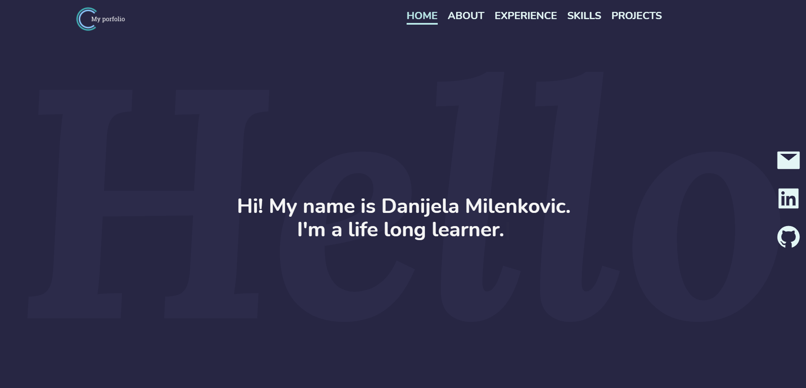

## My portfolio page

A front end page made in React about me and my jurney of becoming a software developer.

|  |
| :---------------------------: |
|           Homepage            |

## How to use it

-   **Clone the repo:https://github.com/Danijela2019/portfolio.git**

-   **Position yourself (cd) in the my-portfolio folder**
-   **Install packages: npm install**
-   **Run this command in your terminal 'npm start'**
-   **View the application in the browser(http://localhost:3000)**
-   **Preview of the app is available on Netlify [here](https://danijelamilenkovic.netlify.app/)**
